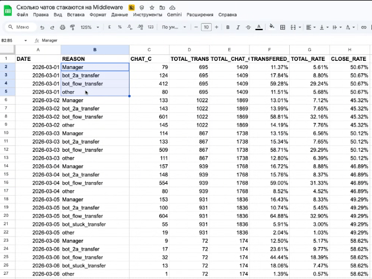
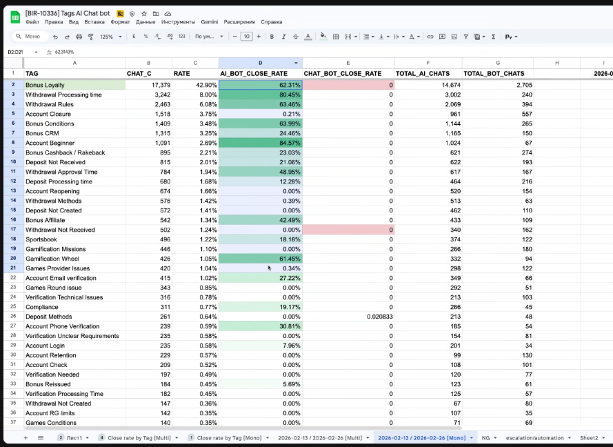
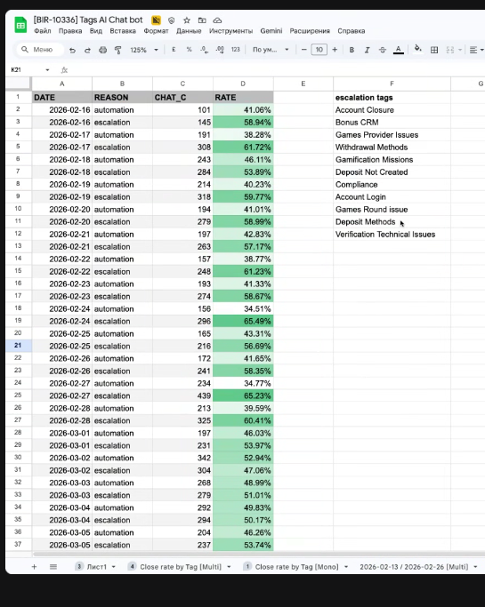
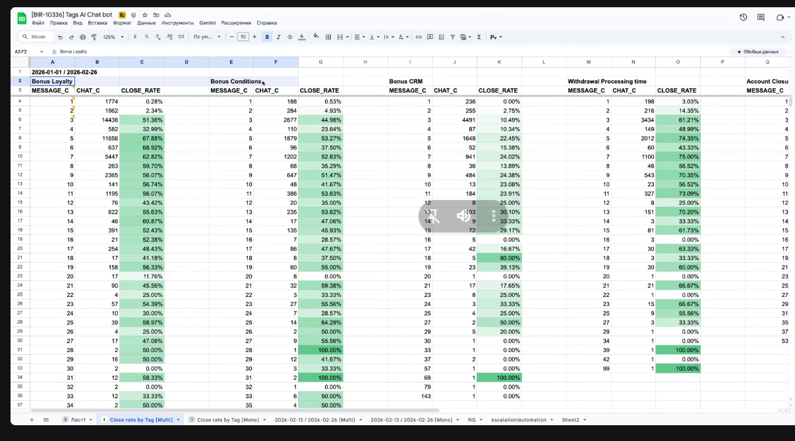

На runpod на h100 запустили новый qwen3.5-27b, включили awq 4bit, спекулятивную гнерацию, 5-6 секунд медианное время, иногда runpod не запущен, b100 в 4бита быстрее, есть только b200, а это много.

Начали править промпты, добавили, чтобы пересправшивала модель, если не понимает контекст, то есть она уточняет перед вызовом скилла.

Табличка по чатам, которые были переведены на оператора. 

Обсудили момент, как непосредственно проверять, сколько сообщений будет оптимально. Необходимо количественно разделить выборку на две части, чтобы сверху сумма по числу сообщений составляла примерно 80% относительно нижней суммы. Если мы переходим из 80 в 20, то это значит, что мы переходим со стороны более эффективной части по количеству сообщений в менее эффективную часть по числу сообщений. Это означает, что, например, если мы до пятого сообщения корректно видим, что 80%... обращений закрывается, то общая цепочка сообщений не должна превышать 5.

Важно отметить еще один момент, связанный с использованием реранкера. Владимир сейчас подключил реранкер, чтобы производить более точный поиск по базе знаний. В рамках подключения были проблемы с запуском непосредственно на процессоре, но они решены. Сейчас подключен Qwen3 0.6 миллиарда параметров. Был предложен совет по использованию фаундейшн моделей, которые лучше справляются с точки зрения качества результата. Например, GINA, мультиязычная последняя версия. Важно отметить, что... Она базируется на той же архитектуре, что и текущее решение, что позволяет, в принципе, не вносить дополнительные технические изменения. При этом вопрос, связанный с дообучением своей модели переранжирования, они не стоят до момента, пока, соответственно, не проведется бенчмарк между фаундейшн моделями, которые являются сейчас State of the Art. И затем, соответственно, необходимо провести разбор движка поиска, если вопрос фаундейшн модели недостаточный. Почему сейчас процесс дообучения под задачу не совсем объективен? По причине, что прикладная область казино, она достаточно общая и базовая. Там нет специфической терминологии. И в целом все задачи поднятия блоков решаются в рамках фаундейшн моделей.
