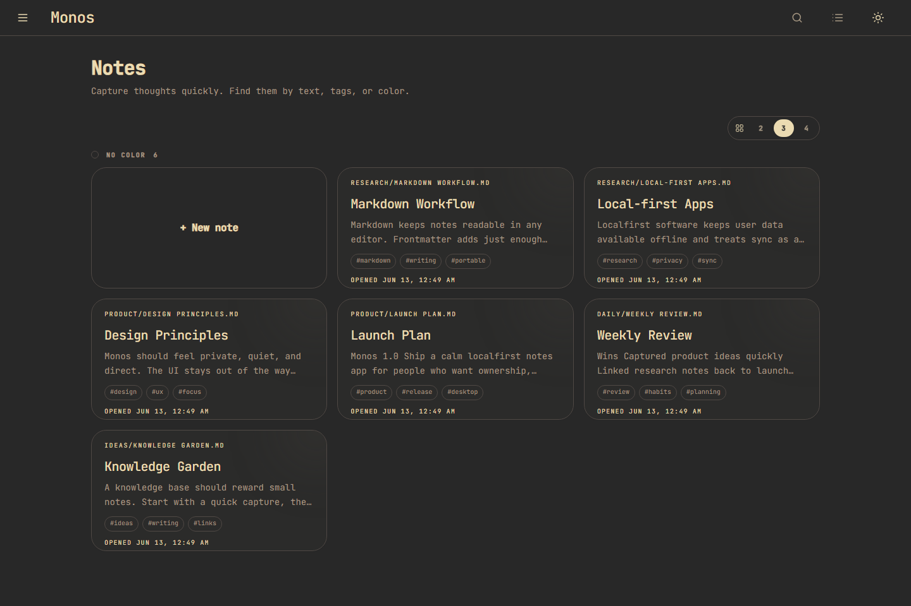

# Monos

Monos is a local-first desktop notes app for people who want a fast personal knowledge base without handing their notes to a cloud service.

It combines Markdown files, wiki-style links, a clean dashboard inspired by Google Keep, full-text search, and Git sync into one focused workspace.

[Website](https://aa-blinov.github.io/monos/) · [Downloads](https://github.com/aa-blinov/monos/releases) · [Architecture](docs/ARCHITECTURE.md)



## Why Monos

- **Local-first by design**: notes live on your machine as plain Markdown files.
- **Desktop-ready**: packaged with Electron for Windows and macOS.
- **Private by default**: user notes are runtime data, not repository content.
- **Markdown plus rich editing**: write naturally, keep portable text files.
- **Wiki links and backlinks**: connect ideas with `[[Note title]]`.
- **Board view**: scan recent notes in a compact, card-based dashboard.
- **Search that understands content**: search titles, tags, and note bodies.
- **Git sync**: optional repository-backed backup and synchronization.

## Desktop Data Location

Monos stores user data in the operating system's standard application data directory:

- **Windows**: `%APPDATA%/Monos/MonosData`
- **macOS**: `~/Library/Application Support/Monos/MonosData`

Inside that directory:

- `notes/` contains user Markdown files and attachments.
- `.data/notes.db` is a rebuildable SQLite index/cache.

The application repository does not ship personal notes.

## Development

### Requirements

- Node.js 22+
- npm
- Git

### Install

```bash
npm install
npm --prefix webui/backend install
npm --prefix webui/frontend install
```

### Run Web UI Locally

Backend:

```bash
cd webui/backend
node index.js
```

Frontend:

```bash
cd webui/frontend
npm run dev
```

The backend runs on `http://localhost:8000`; the frontend dev server runs on `http://localhost:5173`.

### Build Desktop Apps

Windows:

```bash
npm run dist:win
```

macOS:

```bash
npm run dist:mac
```

CI builds both platforms through GitHub Actions and uploads installers as workflow artifacts.

## Versioning

Monos follows [Semantic Versioning](https://semver.org/):

- **MAJOR** versions include breaking changes to note storage, public APIs, sync behavior, or desktop data layout.
- **MINOR** versions add backwards-compatible features, UI improvements, or new settings.
- **PATCH** versions contain backwards-compatible bug fixes, dependency updates, and small polish changes.

Release tags use the `vMAJOR.MINOR.PATCH` format, for example `v1.0.0`.

## Quality Checks

```bash
npm run check:backend
npm run test:backend
npm run check:frontend
npm run test:frontend
npm run test:scale
npm run build:frontend
```

## Documentation

- `docs/ARCHITECTURE.md` explains the system design.
- `docs/FRONTMATTER.md` documents note metadata.
- `docs/CONTRIBUTING.md` covers development workflow.
- `webui/README.md` describes the web application internals.

## License

MIT
